# Data Flow Diagrams

## NFT-Based Federated Learning System

This document provides comprehensive data flow diagrams for the implemented system, showing how data moves through different components and processes.

---

## 1. System Overview - High-Level Data Flow

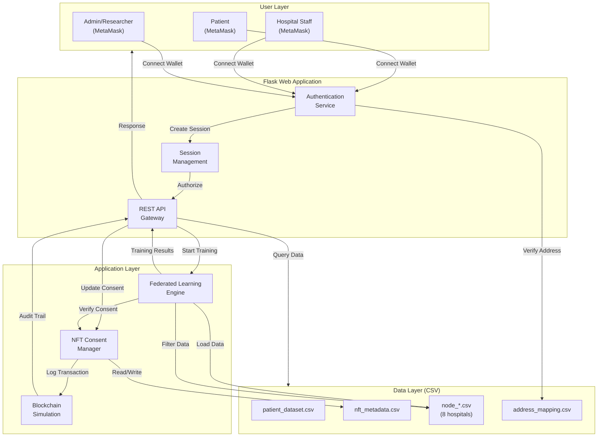

---

## 2. Authentication Flow

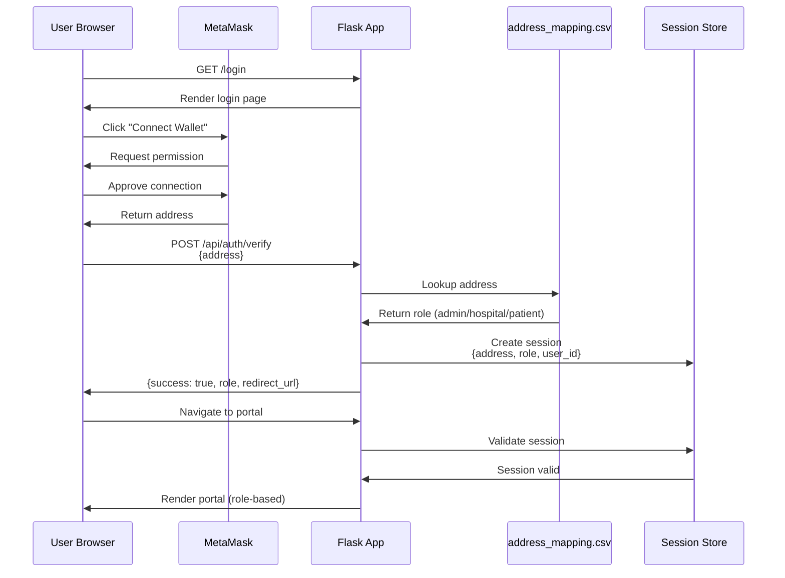

---

## 3. Patient Consent Update Flow

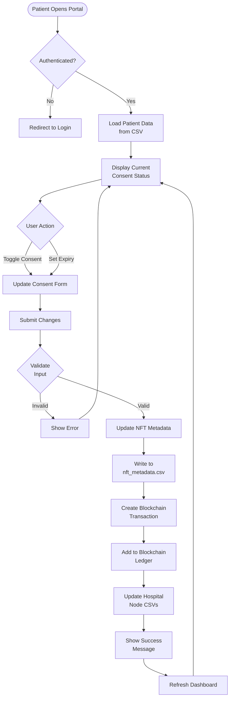

---

## 4. Federated Learning Training Flow

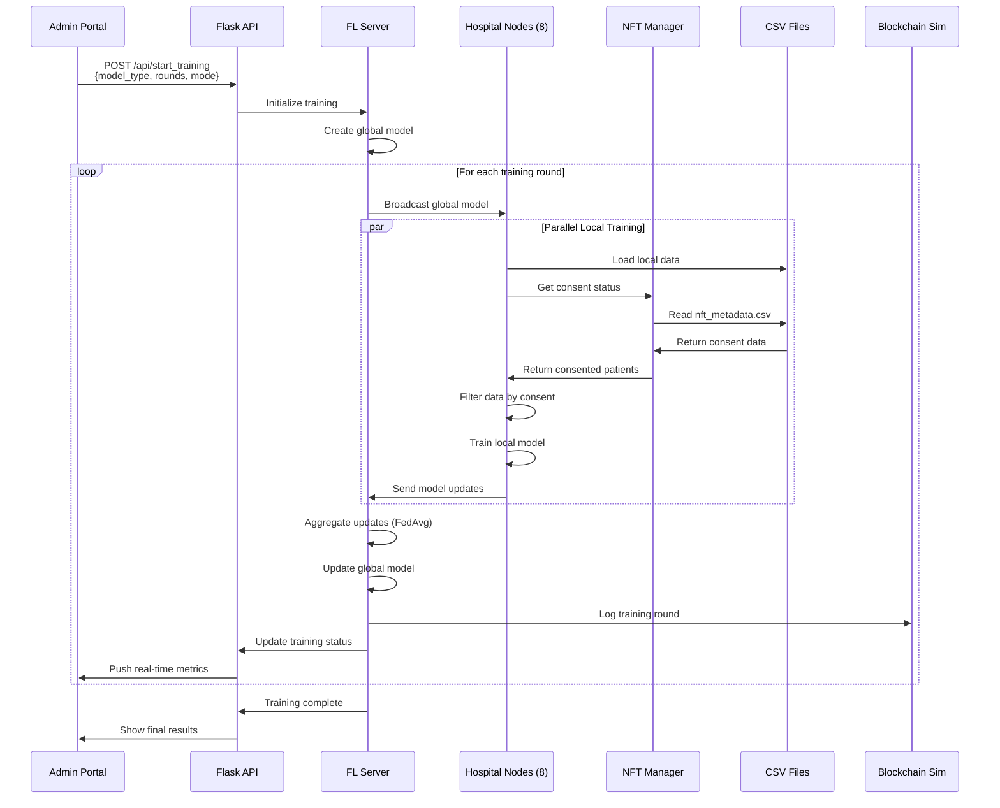

---

## 5. Consent Filtering Process

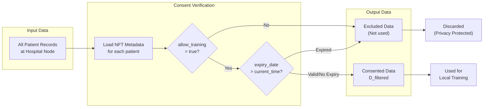

---

## 6. Hospital Portal Data Access Flow

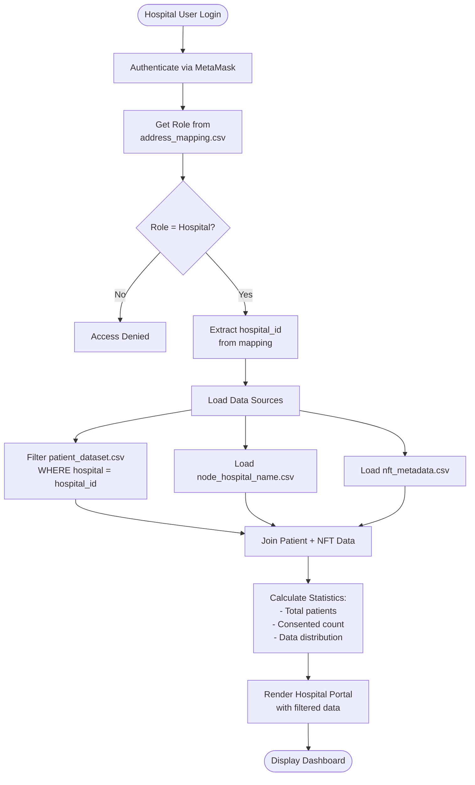

---

## 7. Blockchain Transaction Flow

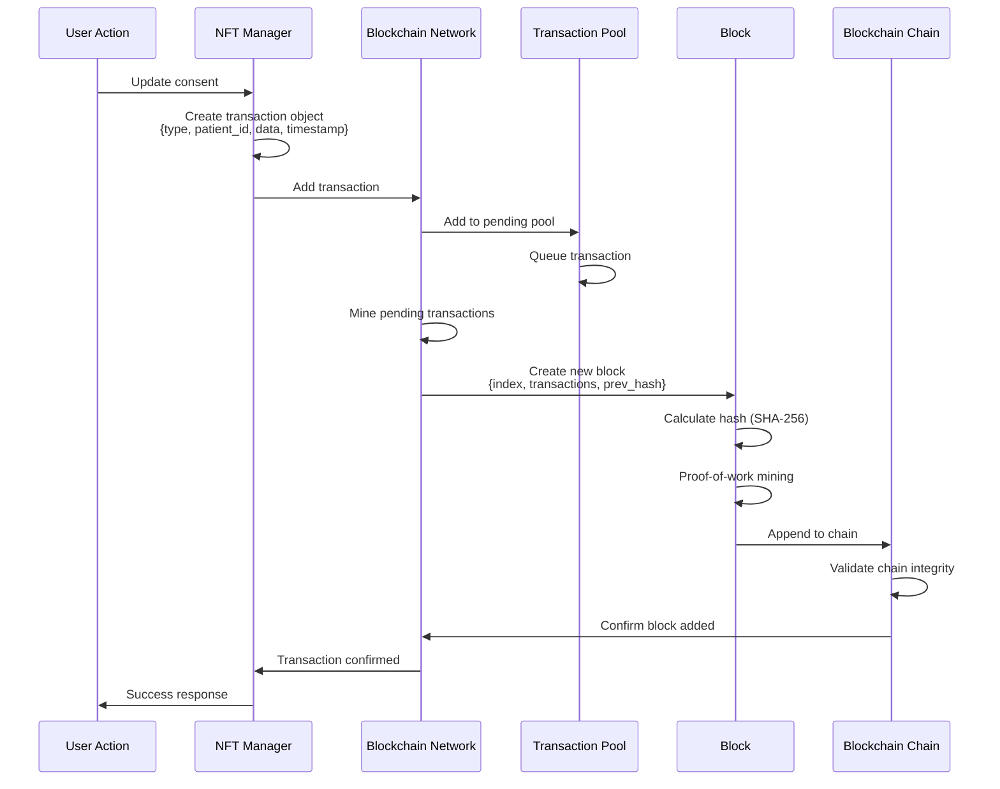

---

## 8. Model Aggregation Flow (FedAvg)

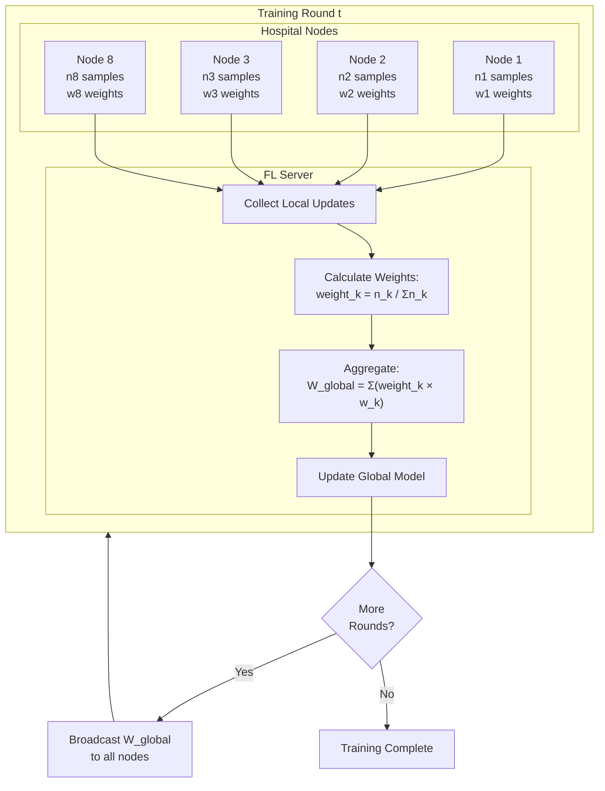

---

## 9. Complete End-to-End Training Workflow

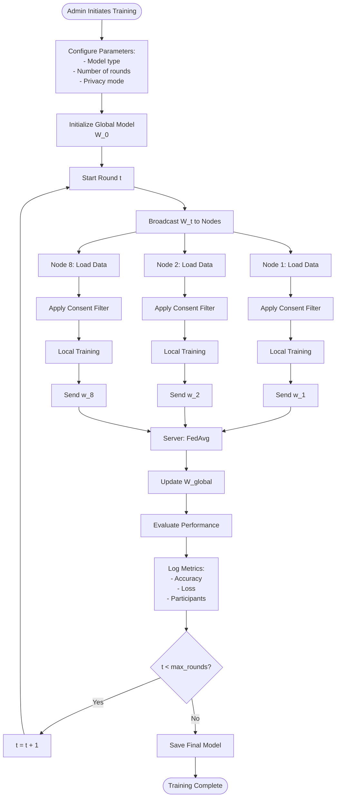

---

## 10. Data Layer Relationships

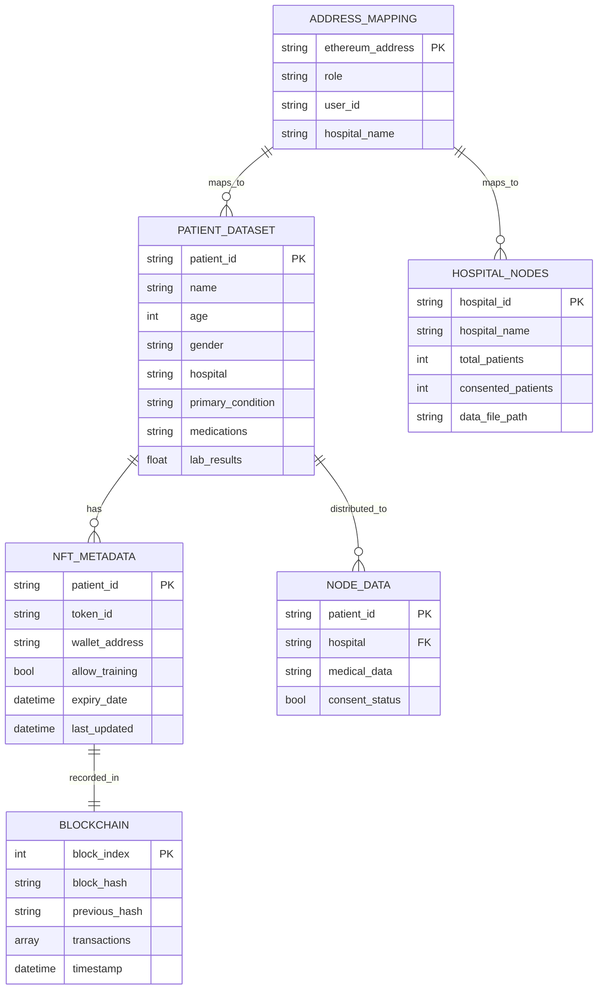

---

## 11. Privacy-Preserving Data Flow

```mermaid
flowchart LR
    subgraph Hospital1["Hospital 1"]
        Raw1["Raw Patient Data<br/>(Never Shared)"]
        Filter1["Consent Filter"]
        Local1["Local Model<br/>Training"]
        Params1["Model Parameters<br/>(Weights Only)"]
    end
    
    subgraph Hospital2["Hospital 2"]
        Raw2["Raw Patient Data<br/>(Never Shared)"]
        Filter2["Consent Filter"]
        Local2["Local Model<br/>Training"]
        Params2["Model Parameters<br/>(Weights Only)"]
    end
    
    subgraph Server["Central Server"]
        Aggregate["Federated<br/>Averaging"]
        Global["Global Model<br/>W_global"]
    end
    
    Raw1 -.->|Never Leaves| Filter1
    Filter1 --> Local1
    Local1 --> Params1
    Params1 -->|Encrypted| Aggregate
    
    Raw2 -.->|Never Leaves| Filter2
    Filter2 --> Local2
    Local2 --> Params2
    Params2 -->|Encrypted| Aggregate
    
    Aggregate --> Global
    Global -.->|Broadcast| Hospital1
    Global -.->|Broadcast| Hospital2
    
    style Raw1 fill:#ffcccc
    style Raw2 fill:#ffcccc
    style Params1 fill:#ccffcc
    style Params2 fill:#ccffcc
```

---

## 12. Real-Time Dashboard Update Flow

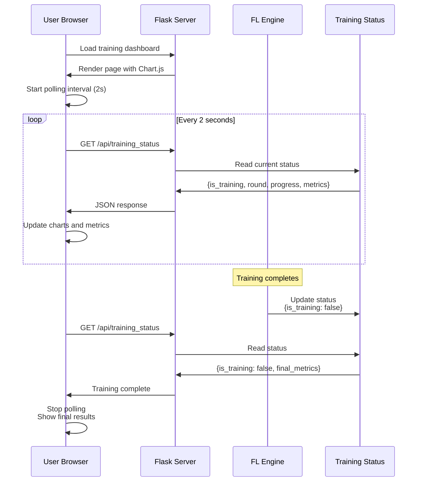

---

## Summary

These diagrams illustrate:

1. **System Overview**: High-level component interactions
2. **Authentication**: MetaMask wallet-based login flow
3. **Consent Management**: Patient consent update process
4. **Federated Learning**: Complete training workflow
5. **Consent Filtering**: Privacy-preserving data selection
6. **Hospital Portal**: Role-based data access
7. **Blockchain**: Transaction and block creation
8. **Model Aggregation**: FedAvg algorithm implementation
9. **End-to-End Training**: Complete training lifecycle
10. **Data Relationships**: CSV file structure and relationships
11. **Privacy Flow**: Data isolation and parameter sharing
12. **Real-Time Updates**: Dashboard polling mechanism

All diagrams are based on the actual implemented system architecture.

---

**Document Version**: 1.0  
**Last Updated**: December 9, 2025  
**Format**: Mermaid diagrams (rendered in Markdown viewers)
